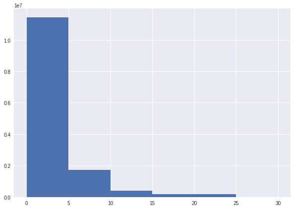

#Part 1A

```
import csv
from google.colab import drive
drive.mount('/content/gdrive')
from google.colab import files
lst =[]
f = open('gdrive/My Drive/trip_data_12.csv', 'r')
reader = csv.reader(f)
import datetime
minval = None
maxval = None
n = 0
for row in reader:
    if n > 0:
        dto = None
        dts = row[5]
        try:
            dto = datetime.datetime.strptime(dts,"%Y-%m-%d %H:%M:%S")
        except Exception as e:
            print(e)
        if dto is not None:
            if maxval is None or dto > maxval:
                maxval = dto
            elif minval is None or dto < minval:
                minval = dto
    n+=1
lst.append(minval)
lst.append(maxval)

```

Output : ['medallion', ' hack_license', ' vendor_id', ' rate_code', ' store_and_fwd_flag', ' pickup_datetime', ' dropoff_datetime', ' passenger_count', ' trip_time_in_secs', ' trip_distance', ' pickup_longitude', ' pickup_latitude', ' dropoff_longitude', ' dropoff_latitude']
14
['D7D598CD99978BD012A87A76A7C891B7', '82F90D5EFE52FDFD2FDEC3EAD6D5771D', 'VTS', '1', '', '2013-12-01 00:13:00', '2013-12-01 00:31:00', '1', '1080', '3.90', '-73.97934', '40.776653', '-73.981865', '40.73428']
14


#Part 1B

```
import datetime,csv
import csv
from google.colab import drive
drive.mount('/content/gdrive')
from google.colab import files
f = open('gdrive/My Drive/trip_data_12.csv', 'r')
reader = csv.reader(f)
minval = None
maxval = None
n = 0
for row in reader:
    if n > 0:
        dto = None
        dts = row[6]
        try:
            dto = datetime.datetime.strptime(dts,"%Y-%m-%d %H:%M:%S")
        except Exception as e:
            print(e)
        if dto is not None:
            if maxval is None or dto > maxval:
                maxval = dto
            elif minval is None or dto < minval:
                minval = dto
    n+=1
lst.append(minval)
lst.append(maxval)
print(max(lst), min(lst))

```

Output: 2013-07-01 01:14:24 2013-03-22 08:04:00



#Part 2
